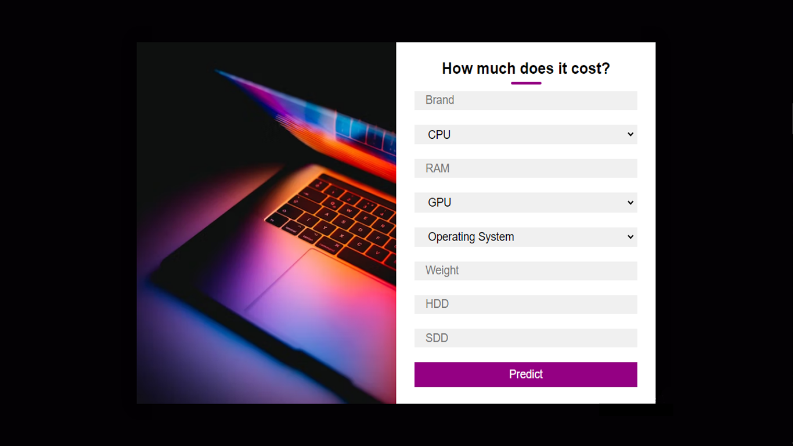
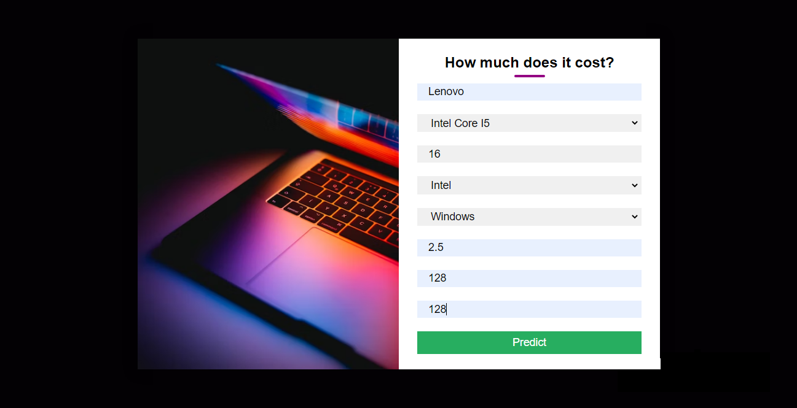
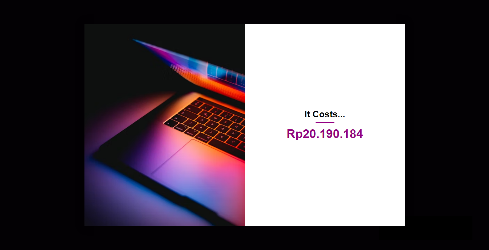

# Laptop Price Prediction App

</img>

## About

This project was made by me and my friend, Ariq, to learn more about machine learning, web, and android. The dataset used is from <a href="https://www.kaggle.com/datasets/muhammetvarl/laptop-price">kaggle</a>.

## Obstacles

- [x] Choosing the right algorithm that would be use for modelling.
- [x] Selecting features that would be use in the model.
- [x] Encode the features, especially the cpu.
- [x] How to make a card layout in website.

## Deployment

- [x] Web, using flask
- [x] Android

## What it do?

This app can predict the price for a laptop based on :

1. Brand
2. CPU
3. RAM
4. GPU
5. Operating System
6. Weight
7. HDD
8. SDD

## How does it works?

The prediction was made using the model in the <b>model folder</b>. The model is using random forest regressor algorithm.

## Prerequiste

The app itself require flask, scikit-learn, and numpy to run. The version is in the <b>requirements.txt</b>

## How to run it?

To run it, you can simply write this in your terminal. You can access the web via the localhost written in the terminal.
<code>python app.py</code>

## App Screenshots

</img>
</img>
</img>
